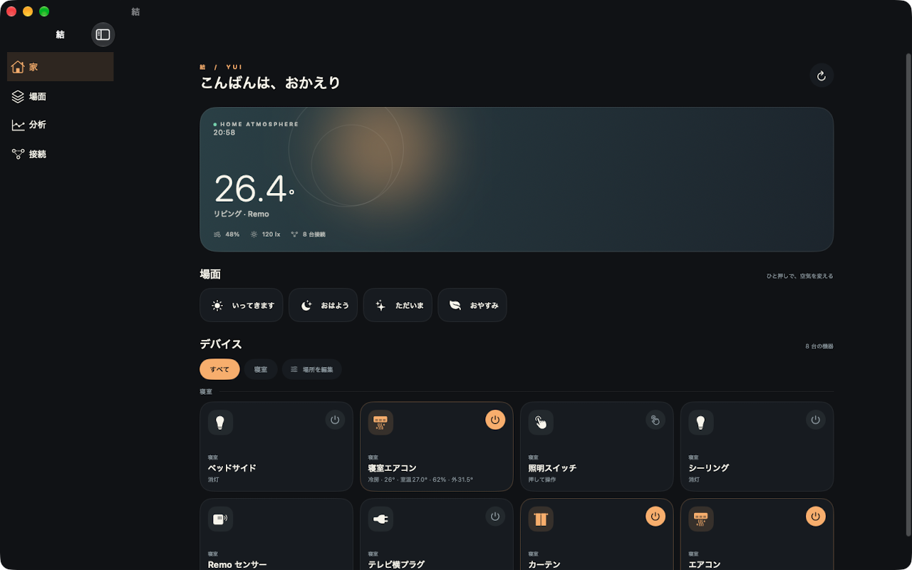
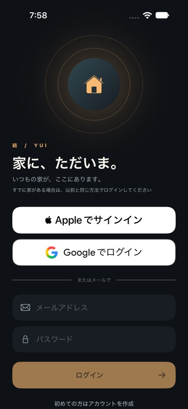
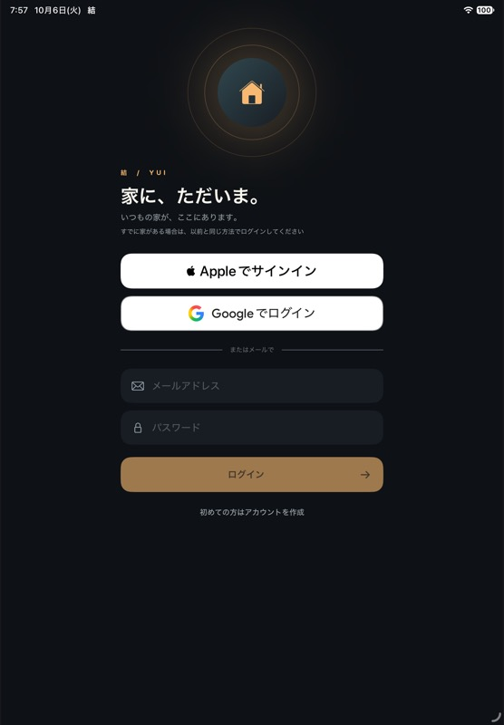

# iPad・Macの実装と審査提出

## 実装

iPhoneと同じSwiftUIのアプリをiPadへ広げ、Mac Catalystを有効にした。同じbundle IDとアプリ登録で、同じ結の家とサブスクリプションを使う。広い画面はサイドバー、狭い画面は従来のタブで切り替える。機器の列数は画面幅に応じて変わる。

ホーム・場面・分析・接続・ログインの横幅を調整し、iPadの縦横表示に対応した。project.ymlと生成プロジェクトのビルド番号の食い違いも揃えた。サーバーと家電通信の実装は変更していない。

Macの機器詳細を開くと共有セッションが渡らず終了する不具合を再現し、sheetへ親のセッションを渡して修理した。検証用ランチャーがSwiftの実行環境を引き継いで起動を失敗させる問題も、同じバイナリで原因を切り分けた。[再現と比較](../rag/mac-catalyst-launch-verification.md)。

## 検証

- Macで審査用アカウントの認証、家の取得、再起動後のKeychain復帰を確認した。
- iPadとMacでデモ照明の機器詳細を開き、ON→OFFと表示更新、閉じる操作を確認した。実家電は動かしていない。
- Macで場面編集とオートメーション作成を開き、保存せず閉じた。分析では照明の入切と操作履歴を表示できた。
- iPadは縦向き3列、横向き4列の機器一覧と場面への切替を確認した。
- iPadの関連6試験、Macの関連7試験、iPhoneの購入キャンセル比較1試験が成功した。Webの規定チェックとNode295試験も成功した。
- iPadとMacの課金全試験はApple Accountの入力画面で中断した。Mac CatalystのStoreKitTestにはキャンセル注入APIがないため、その1件は理由付きで除外する。購入の実環境確認を成功とは扱わない。

画面写真は審査用のデモデータ。Macは1280×800、iPadは13インチの原寸画像を使う。

## 提出の現在地

実装コミット`8204649`をmainへpushし、`origin/main`の祖先であることを確認して配布用アーカイブを作成した。iPhone・iPadは1.0（10）、Macは1.0（11）。MacはApple SiliconとIntelの両方を含み、App Sandbox・送信ネットワーク・Sign in with Appleの配布署名を確認した。試験用のファイルとDebugの認証確認・プレビュー入口は配布物に含まれない。

両方で書き出し、Appleのバイナリ検証、altoolアップロード、`VALID`を確認した。iPadの13インチ写真3枚とMac写真3枚を登録し、説明文も同じ家と契約を共有する内容へ更新した。審査用の連絡先と認証情報を引き継ぎ、新しい検証結果と購入試験の未完了を審査メモへ記載した。

既存iOS版1.0はApple公式APIで審査済みビルド5の公開待ちを取り下げ、ビルド10へ差し替えた。2026年10月4日21時34分（日本時間）に再提出し、`WAITING_FOR_REVIEW`を確認した。提出IDは`5750afa1-dc53-4acd-91a1-bb204d253190`。

Mac版1.0は同じアプリ登録へ追加し、ビルド11を割り当てた。同日21時37分（日本時間）に提出し、`WAITING_FOR_REVIEW`を確認した。提出IDは`a4e0c889-f652-4f5f-b8b3-9703a8d258c1`。

どちらも公開方式は`MANUAL`。審査通過後の一般公開は実行していない。両ビルドを既存の「結 内部テスト」へ割り当て、`IN_BETA_TESTING`を確認した。iPhone・iPad・Macの実機でのTestFlight更新後の確認は未完了。

Jev BookmarksはApp Store Connectのログイン画面で停止し、Jev Desktopも読み取りの時間切れで操作できなかった。画面操作はコンピューター操作API、Macの画像寸法の調整はagent-desktopのウィンドウID指定、原寸保存はOSの標準キャプチャで進めた。提出はApple APIを使い、ログイン待ちやツールの失敗を成功とは扱っていない。

## ログイン表示の拒絶への対応

2026年10月5日のApple審査で、iOS版1.0（10）がGuideline 4（Design）により拒絶された。審査端末はiPad Air 11インチ（M3）とiPhone 17 Pro Max。本文はAppleの通知メールで同じ提出IDと照合した。指摘は、Appleログインを他のログイン方法と同等の選択肢として表示し、ボタンのデザインを同等にすること。色・寸法のどれを問題にしたかは本文に書かれていない。

Appleの独自ボタンを白い`ASAuthorizationAppleIDButton`へ替え、既存の認証処理を呼ぶ。Googleの`g.circle.fill`も公式の多色GとGoogle Sansへ替え、Googleが指定する白い配色にした。どちらも幅と高さ57ptを揃え、アプリの開発言語を日本語にした。根拠は[表示基準の確認](../rag/ios-app-store-review.md)。

iPhone 18 ProとiPad Air 11インチ（M4）のiOS 27.0シミュレーターで、日本語表示、同じ幅と高さ、初期画面内での視認性を画面画像で確認した。iPhoneの操作APIはAppleボタンのタップ成功を返したが、認証画面への遷移は確認できなかった。iPadのアクセシビリティ取得は接続の時間切れで失敗した。今回の確認をApple認証の成功とは扱わない。

lint、typecheck、既存295試験、開発用Webビルドは通過。iOSとMac Catalystのビルドで、公式ボタン・ロゴ・フォントを組み込めることを確認した。

修正コミット`35b9e7b`をmainへpushし、`origin/main`の祖先であることを確認して、iOS版1.0（12）のReleaseアーカイブを作成した。署名、暗号化申告`NO`、日本語の開発言語、公式Googleロゴとフォント、試験素材の除外を配布物で確認した。AppleのIPA検証とaltoolアップロードはエラーなしで成功した。

Apple側の処理`VALID`と、既存の「結 内部テスト」へ割り当てた後の`IN_BETA_TESTING`を確認した。ビルドIDは`e2835427-feb4-4083-8f7b-0bad0b92a51d`。審査説明へ修正内容と確認範囲を追記し、既存の審査認証情報が変わっていないことを照合した。

2026年10月6日8時7分（日本時間）、同じ提出`5750afa1-dc53-4acd-91a1-bb204d253190`をビルド12で再送した。提出とiOS版の両方で`WAITING_FOR_REVIEW`、審査項目1件で`READY_FOR_REVIEW`を確認した。一般公開は手動設定のまま、Appleの審査結果を待つ。TestFlightの実機導入と認証画面の操作確認は未完了。Mac版1.0（11）の提出も引き続き`WAITING_FOR_REVIEW`。

