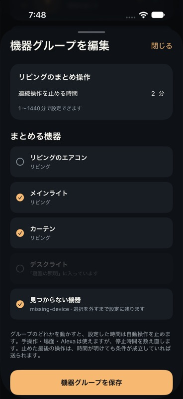
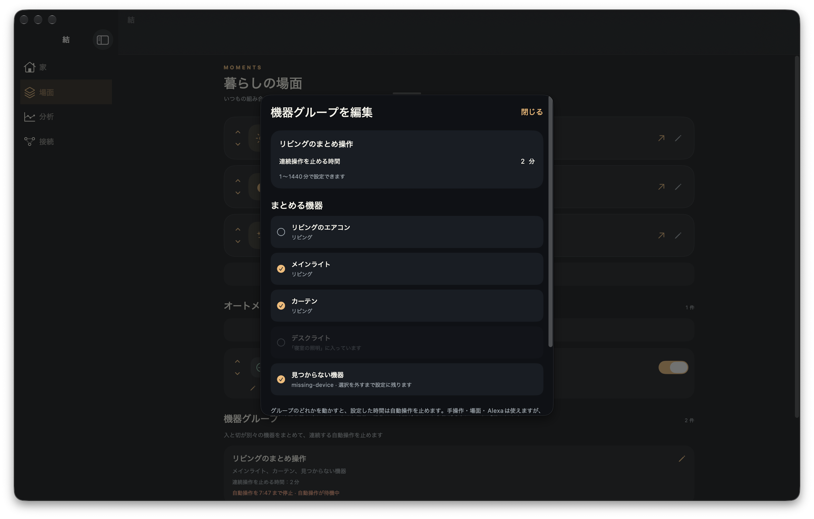

# iPhone・Macの機器グループ

場面画面に機器グループを追加した。作成・編集・削除、機器の選択、停止時間の入力、停止期限と待機中の操作の表示を、iPhoneとMac Catalystで共有する。保存には既存の`group-save`・`group-remove`を使い、家全体とサーバーの実行記録を送信しない。

他グループの機器は選べない。同期で一時的に見えなくなった機器は、利用者が外すまで選択に残す。名前・機器・分数が未入力、または分数が1〜1440の範囲外なら保存できない。通信や保存に失敗した場合は編集画面に理由を表示し、画面を閉じずに設定を残す。

## 検証

- iPhone 18 ProのiOS 27シミュレーターで、一覧・作成・編集画面を開き、既存の機器の選択、不在の機器、別グループの機器の表示を確認した。
- Macの検証用アプリで編集画面を開き、日本語の名前を入力した。停止時間1441では保存不可、2へ戻すと保存可能になることと、削除確認を取消して元の画面へ戻れることを確認した。実際の家と家電は変更していない。
- `YuiDeviceGroupTests`の4件が成功。旧形式の家の読取、待機状態と停止期限、作成・編集・削除の送信形式、応答の反映、保存失敗時の設定維持、入力の境界、不在機器の維持を検査した。送信試験は`URLProtocol`による模擬サーバーを使う。
- 変更前に関連する`YuiHomeRefreshTests`の3件を確認し、成功した。iOS・Mac CatalystのDebugビルドも成功した。
- `npm run lint`、`npm run typecheck`、`npm test`（324件）、`npm run build:dev`が成功した。

Macの編集画面を開く操作はJevで成功した。文字入力はagent-desktopの表示名とプロセス名の照合で`STALE_REF`、プロセス名での再指定は`APP_NOT_FOUND`になった。この失敗をユーザーへ報告し、最終的な入力・取消の確認をコンピューター操作APIで行った。iPhoneの操作APIは日本語の直接入力に対応しておらず、文字入力の成功確認には含めない。

## 配布と本番確認

配布用ビルド番号は`ios/project.yml`を正本とし、初回の内部配布はiOSが13、Mac Catalystが14。この時点では既存の審査提出を差し替えず、後述の審査提出で最新ビルドへ更新した。

実装コミット`833ceef`をmainへpushし、`origin/main`の祖先であることを確認してReleaseアーカイブを作った。iOS版1.0（13）とMac版1.0（14）は、配布物の署名、ビルド番号、試験素材の除外、Appleのバイナリ検証、altoolアップロードが成功。MacはApple SiliconとIntelの両方を含む。2026年10月7日、両ビルドの`VALID`と既存の「結 内部テスト」への割当後の`IN_BETA_TESTING`を確認した。実装コミットのGitHub CIも成功した。

Macの最初の書き出しは、証明書名による指定でインストーラー証明書がアプリ用プロファイルに合わないというエラーになった。前回の成功した配布設定と、Xcodeの`signingCertificate`・`installerSigningCertificate`の説明を照合し、アプリ用とインストーラー用の証明書をそれぞれ指定すると書き出しが成功した。

サーバーはリトルマーメイドが同日7:36に機器グループ対応を配備したと報告し、公開面が200、未ログインの家APIが401であることを確認した。今回の変更はネイティブアプリだけなので、追加のサーバー配備は行っていない。

本番の審査用アカウントには、デモ機器8台、実機0台、オートメーション0件、グループ0件があることを読取で確認した。その家だけで、Macアプリからデモ照明2台の試験用グループを作成し、2分から3分へ編集・保存した。iPhoneシミュレーターは同じ家から3分を読み取り、4分へ変更して保存した。公開APIを読み返し、4分と機器2台が本番に残っていることを確認した。片付けは公開APIの`group-remove`で今回のグループだけを削除し、機器8台と場面の内容が保たれたこと、iPhoneの一覧も0件に戻ったことを確認した。実家電は操作していない。

iPhoneの入力APIは成功を返しても値が3分のままだったため、その結果を成功とは扱わず、Device Hubの操作APIで入力・保存した。同じシミュレーターで別のアプリが前面に出た場面では、結を開き直し、操作先を確認してから続けた。Mac・iPhoneともに、認証情報を配布物や操作ログへ入れない既存のDebug認証試験入口を使った。

所有者のiPhone・MacへのTestFlight更新、配布版の実機画面、実機の換気扇、Alexaからの操作は未確認。本番への作成・編集は開発用アプリで確認したものであり、TestFlightからの導入確認とは分ける。

## Macの保存案内と時間入力の修理

2026年10月7日、利用中のMac版で機器2台と60分が入力されているのに、グループ名が空で保存ボタンが無効になっていた。名前の見出しや枠がなく、無効な理由も表示されず、押しても動かないように見えていた。時間欄も枠がなく、幅65ポイントで数字を右寄せしていた。

名前と時間に見出し・枠・フォーカス表示を付け、時間欄を120ポイントへ広げて左寄せにした。保存は入力不足でも押せるようにし、名前・機器・分数のどれが不足しているかを表示する。入力が不正な間はサーバーへ送信しない。全角数字と前後の空白は同じ整数として受け取り、分数の範囲は1〜1440のままにした。

追加した入力試験で、変更前に全角数字と空白を受け付けないことを再現した。修正後のSwiftの関連6試験、Macビルド、lint、型検査、Node324試験、開発ビルドが成功した。Jevで再現画面を開き、入力の検証は操作APIで行った。修正版では保存時の不足理由と入力欄へのフォーカス、通常のクリック・全選択・削除・再入力、全角の置換を確認した。

本番の審査用の家だけで、修正版Macから通常のキーボード入力で60分を設定し、デモ照明2台のグループを保存した。公開APIで60分を読み返し、今回の試験グループだけを片付け、機器と場面が維持されることを確認した。所有者が編集中のMacの家と、実家電には変更を加えていない。

修正コミット`c6de8d7`をmainへpushし、既定ブランチの祖先であることを確認して配布物を作成した。iOS版1.0（15）とMac版1.0（16）は、署名・試験素材の除外・Appleの検証・アップロードが成功。両方の`VALID`と、既存の「結 内部テスト」への割当後の`IN_BETA_TESTING`を確認した。修正コミットのGitHub CIも成功した。

MacのTestFlightではビルド16の更新を表示したが、最初のダウンロードは更新ボタンへ戻り、導入版は14のままだった。編集中の設定をローカルへ退避し、アプリを終了した状態で再実行した。`/Applications/Yui.app`のビルド16への更新と、TestFlightからの通常起動を確認した。

更新後のアプリが審査用アカウントで起動した。Debugの認証試験入口が、通常ログインと同じKeychainの`session`へ保存することが原因だった。審査用アカウントをログアウトし、通常のGoogle認証を開始したが、こちらでは認証画面を表示できず、所有者がGoogleログインを完了した。元の家の取得と、保存済みの換気扇グループ（オン・オフの2台、60分）を確認し、その編集画面へ戻した。

再発を防ぐため、`-yui-test-login`で起動したDebugだけはKeychainの`session-test-login`を使う。Releaseの保存先と認証処理は変えない。変更後の関連9試験、MacのDebugビルド、GitHub CIが成功した。

## 最新ビルドのApp Store審査提出

2026年10月7日、所有者の指示で、審査待ちだったiOS版1.0（12）とMac版1.0（11）の提出を取り下げ、機器グループと入力欄の修理を含むiOS版1.0（15）とMac版1.0（16）へ差し替えた。両ビルドは`VALID`・`APP_STORE_ELIGIBLE`で、実装コミット`c6de8d7`が`origin/main`の祖先であることを再確認した。配布済みのバイナリを使い、再ビルド・追加アップロードは行っていない。

既存の審査用認証情報と連絡先を保持し、機器グループの確認手順、入力・保存の検証結果、購入の追加実環境試験を行っていないことを審査説明へ追記した。保存後に、審査説明の一致、認証情報と連絡先の維持、対象ビルド15・16、公開方式`MANUAL`を公式APIで照合した。

| 対象                   | 提出時刻（日本時間） | 提出ID                                 | 提出後の状態         |
| ---------------------- | -------------------- | -------------------------------------- | -------------------- |
| iPhone・iPad 1.0（15） | 2026年10月7日9:45:59 | `64293d62-2d55-4e5d-9aa4-55d69376449d` | `WAITING_FOR_REVIEW` |
| Mac 1.0（16）          | 2026年10月7日9:46:08 | `2d339329-5729-48c8-bf71-dee1fbd77cab` | `WAITING_FOR_REVIEW` |

提出を読み返し、両提出とApp Store版が`WAITING_FOR_REVIEW`、審査項目が各1件で`READY_FOR_REVIEW`になったことを確認した。公開画面はHTTP 200、未ログインの家APIはHTTP 401だった。承認後の一般公開は手動設定のまま、Appleの審査結果を待つ。
